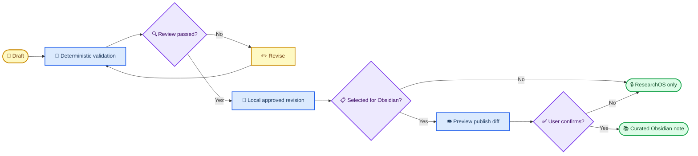

# M015 Personal Content Studio and Obsidian Collaboration Plan

_ResearchOS personal knowledge maintenance roadmap — planned after v0.11.0 release sign-off_

---

## 🎯 Product decision

ResearchOS is the canonical content and revision database. Obsidian is a curated publishing and optional review surface, not a second database and not an automatic event sink.

The system must support two personal workflows:

1. Add new scientific content as drafts, review it, and publish it locally.
2. Export existing built-in or personal content for review, import a versioned patch, preserve the old revision, and roll back when necessary.

There is no continuous two-way sync in M015. Connecting a vault, opening ResearchOS, saving a draft, answering a question, or running an AI review must never create an Obsidian file.

## 🏗️ Ownership boundaries

| Layer | Canonical owner | Default behavior |
| --- | --- | --- |
| Built-in content | Versioned ResearchOS base catalog | Read-only base; never edited in place |
| Personal additions | SQLite personal-content overlay | Draft/pending until explicitly promoted |
| Revisions of old content | Versioned overlay patch | Preserve base revision and history |
| Learning records | ResearchOS only | Never publish to Obsidian by default |
| Obsidian notes | User-curated publication | Written only by explicit confirmed batch |
| Obsidian annotations | Obsidian/user | Imported only as an explicit patch candidate |

An application update replaces the base catalog but retains the personal overlay. If both the new base and the personal overlay changed the same object, ResearchOS creates a conflict for review instead of choosing a winner.

## 🔄 Content lifecycle



## 📚 Personal content workbench

Add a Chinese-first “内容工作台” with these views:

| View | Purpose |
| --- | --- |
| 内容库 | Browse all supported content types and effective revisions |
| 草稿 | Create or duplicate content without affecting training |
| 待审核 | Review queue grouped by scientific risk |
| 发布箱 | Explicitly selected Obsidian publication batches |
| 版本历史 | Compare, restore, supersede, deprecate, or archive revisions |
| 冲突 | Resolve base-update, patch-import, and Obsidian-edit conflicts |

Supported content should converge on one portable content contract: evidence sources, evidence claims, methods, patterns, judgment cards, AI audit cases, Problem Atlas entities, and later Protocol Lab entities.

### New content

- Start from a content-type template or duplicate an existing item.
- Generate a stable ID once; titles and filenames may change without changing identity.
- Save as `draft` or `pending_review`; drafts do not enter Today, Review, search, or training.
- Validate schema, identifiers, duplicates, broken links, missing evidence, terminology, and scientific completeness.
- Require explicit local activation after the applicable scientific gate.

### Existing content revision

- Never overwrite a built-in or personal revision silently.
- Export the selected object plus its evidence, dependencies, current hash, and affected training links.
- Import a patch containing `targetId`, `baseRevision`, `baseHash`, changed fields, reason, reviewer, evidence changes, and proposed status.
- Reject stale patches when `baseHash` no longer matches.
- Show a field-level diff and downstream impact before an all-or-nothing apply.
- Retain every previous revision and keep historical learning records resolvable against the revision used at the time.

### Review pack

The default review export is outside the Obsidian vault:

```text
review-pack-<batch-id>/
├── manifest.json
├── content.json
├── REVIEW_COPY.md
├── SCIENTIFIC_CHANGESET.md
└── dependencies.json
```

This pack is the preferred handoff to Codex, OpenScience, or another reviewer. It prevents agents from scanning the whole repository or writing arbitrary notes into the vault.

## 🧹 Obsidian anti-dumping policy

### Default zero-write behavior

ResearchOS must not write to Obsidian when:

- the app starts or closes;
- a vault path is configured or tested;
- content is created, edited, reviewed, searched, or practised;
- an AI response is generated;
- evidence metadata resolves;
- a learning record, misconception, calibration, or session event is saved.

### Explicit publish transaction

Publishing requires all of the following:

1. The user selects specific content objects.
2. ResearchOS creates an internal outbox batch.
3. A preview lists exact create/update/conflict/unchanged file paths.
4. The preview shows note count and changed sections.
5. The user explicitly confirms that batch.
6. ResearchOS writes atomically only inside the configured dedicated subfolder.

Default batch limit: 20 permanent notes. Larger batches require a second explicit confirmation.

### Vault scope

- The user selects one vault and one dedicated subfolder, recommended as `ResearchOS/`.
- ResearchOS must not read or write outside that resolved subfolder.
- It must not modify `.obsidian/`, install plugins, change vault settings, or scan unrelated notes.
- Path traversal, symlink escape, unexpected junctions, and case-collision risks must fail closed.
- Connecting a vault is read-only validation; it is not permission to publish.

### What is excluded by default

Never publish these unless the user selects a purpose-built export:

- raw AI output;
- learning attempts, scores, review logs, confidence ratings, or misconceptions;
- search history, diagnostic sessions, scheduler events, and drafts;
- every EvidenceClaim as a separate note;
- every citation as a separate source note;
- temporary review artifacts or validator logs;
- duplicate notes generated because a title changed.

The permanent Obsidian unit is a curated concept note, not an application event. Sources and claims are embedded in the concept note by default; standalone source notes are opt-in.

## 🔗 Obsidian note contract

Permanent notes use stable identity and a managed section:

```yaml
---
researchos_id: pa-pseudorep
researchos_kind: problem-card
researchos_revision: 3
researchos_status: user_reviewed
researchos_hash: sha256:...
researchos_published_at: 2026-08-26T00:00:00Z
---
```

```markdown
<!-- researchos:managed:start -->
ResearchOS-controlled curated content.
<!-- researchos:managed:end -->

## 我的笔记

User-owned writing that ResearchOS never overwrites.
```

Rules:

- Republish updates only the managed section when its previous hash still matches.
- User text outside the managed section is always preserved.
- If the managed section was edited in Obsidian, republish creates a conflict preview and writes nothing.
- File renames are tracked by `researchos_id`, not inferred from the title.
- Repeated publication of an unchanged revision is idempotent.

## 🤝 Optional Obsidian review session

Obsidian round-trip review is opt-in and batch-based:

1. The user explicitly sends selected items to `ResearchOS/_Review/<batch-id>/`.
2. ResearchOS writes only that finite review batch and manifest.
3. The user annotates the designated “审核意见” section.
4. The user clicks “检查 Obsidian 审核意见”.
5. ResearchOS performs a read-only scan of that batch and shows a patch preview.
6. Imported changes become `draft` or `pending_review`, never automatically verified.
7. After successful import, ResearchOS offers to archive the batch outside the vault or remove the exact batch after separate confirmation.

No background file watcher is included in M015. There is no automatic pull, automatic merge, or automatic cleanup.

## 🛡️ Scientific and revision gates

| Change | Required gate |
| --- | --- |
| Spelling/layout only | Deterministic diff; LOW risk |
| Metadata identifier/title | Metadata lookup plus provenance |
| Scientific explanation | Risk-classified scientific review |
| Evidence–claim relation | Codex item-level review |
| Reference answer/rubric | Codex item-level review |
| Status promotion | Reviewer and evidence scope recorded |
| Deprecation/supersession | Impact preview and replacement link |

User activation and scientific verification remain separate. The user may activate personal pending content for private study while its UI continues to show the pending status; activation must not relabel it as evidence-verified.

## 🧩 Milestone breakdown

### M015-01 — Unified content inventory and export

- Define portable IDs, revisions, hashes, dependency graph, and effective-content resolution.
- Export selected built-in/personal content as canonical JSON plus review Markdown.
- Add deterministic schema, duplicate, dependency, and provenance audits.

### M015-02 — Personal overlay and content workbench

- Add draft/pending/active/archive lifecycle in SQLite.
- Create, duplicate, edit, search, filter, and preview personal content.
- Keep drafts out of learning/search until explicit activation.

### M015-03 — Versioned patch import and history

- Add base-hash optimistic locking, field diffs, impact analysis, transaction apply, revision history, and rollback.
- Preserve historical learning references and prohibit destructive overwrite.

### M015-04 — Curated Obsidian publishing

- Configure a dedicated subfolder with read-only connection validation.
- Add outbox, exact file preview, batch confirmation, managed blocks, idempotency, and conflict detection.
- Enforce zero writes outside the confirmed publish transaction.

### M015-05 — Optional Obsidian review round trip

- Add finite `_Review/<batch-id>` exports and explicit read-back.
- Convert annotations/edits into patch candidates.
- Add archive/remove workflow with exact-path confirmation.

### M015-06 — Regression and recovery

- Test migrations, backup/restore, app upgrades, base/overlay conflicts, stale patches, rollback, path containment, symlink/junction escape, Unicode filenames, and interrupted writes.
- Follow `.agent/TESTING_POLICY.md`; filesystem tests use temporary non-vault directories.

### M015-07 — Codex content and release gate

- Review product behavior, scientific status transitions, evidence boundaries, representative patch packs, and Obsidian anti-dumping guarantees.
- Approve only from diff, reports, changeset, deterministic artifacts, and focused dependencies.

## ✅ Acceptance criteria

- Connecting or scanning an Obsidian path produces zero file changes.
- A publish preview lists every exact file operation before confirmation.
- Cancellation, validation failure, stale hash, or conflict produces zero writes.
- ResearchOS never touches files outside the dedicated resolved subfolder.
- Manual Obsidian text is byte-preserved across republish.
- Unchanged republish creates no duplicate or modified file.
- New and revised scientific content remains pending until the appropriate gate.
- Old revisions and historical learning links remain resolvable and reversible.
- Application upgrades preserve personal overlays and surface conflicts.
- Review packs are sufficient for Codex/OpenScience without repository-wide rereading.
- Obsidian integration works without a plugin and without a background watcher.

## 📌 Recommended defaults

| Decision | Default |
| --- | --- |
| Canonical store | ResearchOS SQLite |
| Obsidian mode | Explicit curated publish |
| Vault scope | Dedicated `ResearchOS/` subfolder |
| Permanent note type | Curated concept note |
| Separate source notes | Off |
| Learning-log export | Off |
| Automatic watcher/sync | Off |
| Permanent batch limit | 20 |
| Review pack location | Outside vault |
| Obsidian review folder | Explicit temporary batch only |
| Conflict behavior | Fail closed; preview only |
| Manual-note handling | Preserve outside managed block |

## 🚫 Out of scope

- Real-time or continuous bidirectional sync
- Obsidian plugin installation or configuration
- Publishing every database row as Markdown
- Automatic scientific verification or status promotion
- Silent merge of concurrent ResearchOS and Obsidian edits
- Cloud sync, collaboration accounts, or public content marketplace
- Automatic deletion or cleanup inside the vault
