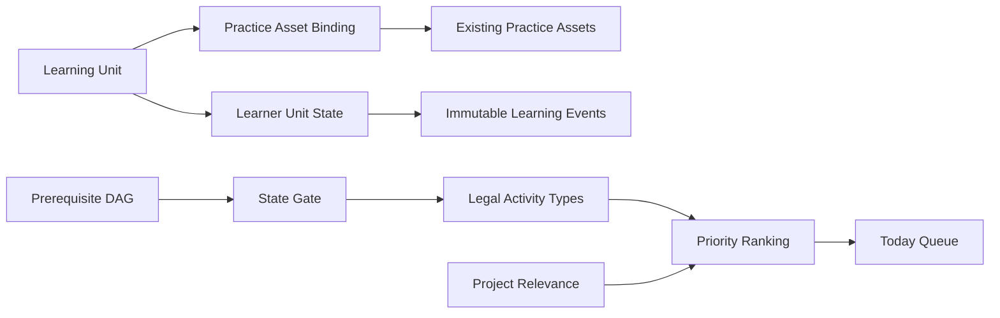
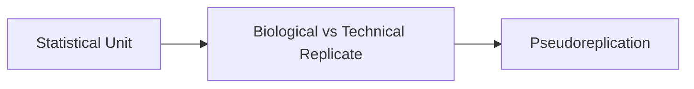

# M016 — Learning Kernel 产品与学习架构规格

状态：**SPECIFICATION COMPLETE — AWAITING OPENCODE IMPLEMENTATION**  
基线：`v0.12.0-rc1`（commit `23eed6b`）  
内部任务前缀：`M016-LK-*`，避免与已经封存的 v0.12.0 发布任务 `M016-01…06` 混淆。

## 🎯 目标与非目标

本里程碑把 ResearchOS 的默认主循环从“先考试、后反馈”改为“先理解、再引导、后独立判断、最后延迟复习与迁移”。Learning Kernel 是上层内容与练习的编排核心，不删除 Problem Atlas、JudgmentCard、Paper、AI Audit、Project 或 Review。

冻结决策：

- 每个 Learning Unit 默认 8–12 分钟。
- Curriculum 是医学科研通识骨架，Project relevance 只动态改变合法候选的排序，不改变先修关系和教学边界。
- Challenge Mode 是用户主动选择的可选诊断捷径。
- 同时最多 2 个 active learning threads。
- 中文先建立直觉和 mental model，再引入精确定义、英文术语、方法学边界与 Reviewer-level nuance。

本轮只实现三个完整原型和一个 5 分钟 onboarding。禁止新增 Problem Cards、AI Audit、Frontier 或零散模块，禁止批量重写现有内容，禁止把 Learning Unit 做成长文章、视频课程或聊天 Tutor。

## 🧭 核心产品模型

Learning Kernel 由五个彼此分离的对象组成：

1. `LearningUnitV1`：稳定的教学结构和科学内容。
2. `LearnerUnitStateV1`：某个用户在某个单元上的当前学习状态。
3. `LearningEventV1`：不可变的学习经历或能力证据事件。
4. `PrerequisiteEdgeV1`：单元之间的有向无环先修关系。
5. `PracticeAssetBindingV1`：把现有练习资产挂到教学角色，而不是复制内容。

该图说明 Learning Unit、用户状态和现有资产如何进入 Today；先修图和状态先限定合法活动，项目相关性只参与最后排序。

## 📚 Learning Unit 教学合同

每个单元必须按 progressive disclosure 渲染为三个可操作层，而不是一段连续正文：

### 先懂

1. 为什么重要：以真实科研问题制造学习需求。
2. 一句话直觉：用简单中文形成 mental model。

### 弄明白

3. 精确定义：标准中文定义，并在首次出现时给英文术语。
4. 机制/结构解释：解释结论为什么成立。
5. Worked Example：完整展示专家如何识别单位、依赖、估计目标和结论边界。
6. Common Misconception：说明错误为什么看似合理，以及错在何处。

### 会判断

7. Guided Practice：允许分层 hint；使用 hint 的表现不算独立能力证据。
8. Independent Practice：撤除提示，锁定答案并记录 confidence。
9. Claim Boundary / Reviewer View：限定适用条件、过度解释风险和审稿检查点。
10. Delayed Review + Far Transfer：延时提取、变式和跨情境迁移。
11. Evidence provenance：逐项连接 EvidenceClaim/EvidenceSource，区分标识符、元数据和 claim 核验。

UI 一次只显示当前层及必要上下文；用户可展开更深层，但默认路径仍按“先懂 → 弄明白 → 会判断”。正文块必须可独立标记完成和恢复，禁止只保存一个“整篇看过”布尔值。

## 🔀 Learning Mode 与 Challenge Mode

### Learning Mode

默认入口为“开始学习”。它从需求、直觉和 worked example 开始，随后进入 guided 和 independent practice。只有完成必需 instruction blocks 才能设置 `instructionCompletedAt`。

### Challenge Mode

次级入口为“我已熟悉，直接挑战”。它必须是无提示、锁定作答、记录 confidence 的独立题：

- 通过：记录独立能力证据，可直接进入 `review_eligible`；instruction exposure 保持原值，`instructionCompletedAt` 不得生成。
- 未通过或未完成：记录真实 attempt，进入 `learning` 并立即提供讲解入口；不得记为零能力或制造 mastery。
- Challenge 通过后，用户仍可随时补学；补学只更新 instruction 轴，不覆盖 challenge 证据。

## 🧩 Curriculum 与先修链

医学科研通识骨架决定概念顺序，项目相关性在同一合法集合内加权。第一阶段唯一启用链：

该图表示三个原型的学习先后关系；后一个单元不能因项目相关性更高而绕过前一个单元的学习门槛。

先修门分两级：

- `start_gate`：先修单元至少已完成关键概念暴露，或有一次合格 Challenge 独立证据。
- `independent_gate`：进入当前单元的 independent practice 前，先修单元至少有 `independent_once` 能力证据。

Project relevance 可以提升与活跃项目相符单元的优先级，也可以选择相符的 worked/transfer 情境，但不得解锁不合法的活动、降低科学风险门或修改 prerequisite DAG。

## 🗓️ Today 编排原则

Today 必须严格执行：

`learner state gate → legal activity type → priority ranking`

状态到合法活动的唯一基础映射：

| Learner state | 合法活动 |
|---|---|
| `unseen` | explanation、worked example |
| `learning` | explanation、self-check |
| `guided` | guided practice |
| `independent_ready` | independent case |
| `review_eligible` | delayed retrieval |
| `consolidating` | variant、spaced retrieval |
| `transferable` | Paper、AI Audit、Project、far-transfer |

旧的固定“Method + Paper + AI + Problem + Transfer”拼盘必须退出默认生成路径。一个 Today 队列只包含当前合法、可解释且在时间预算内的活动。详细算法见 `M016_LEARNING_KERNEL_STATE_AND_SCHEDULER.md`。

## 🧱 PracticeAsset 复用与 Skill Map

现有 `JudgmentCard`、`ProblemCard`、`AuditCase`、Paper task 和 Method case 不删除，也不批量改写。通过 `PracticeAssetBindingV1` 将它们绑定为：

- `worked`：展示专家推理；不产生能力证据。
- `guided`：允许 hint；产生学习证据，不产生独立能力证据。
- `independent`：锁定、无提示、confidence；可产生首次独立能力证据。
- `review`：延迟提取；可产生保持/衰减证据。
- `far_transfer`：陌生或项目情境；可产生迁移能力证据。

Skill Map 必须显示两条互不替代的轴：

- 学习进度：未接触 / 进行中 / 教学完成，以及已完成的 progressive-disclosure 块。
- 已证明能力：未评估 / 引导中 / 独立一次 / 延迟保持 / 可迁移。

“看过讲解”不得显示为 mastery；“还没独立作答”显示为“尚未评估”，不能显示为 0 分。

## 🧪 第一阶段原型和 Onboarding

只实现以下内容：

1. `lu-statistical-unit-v1`
2. `lu-biological-technical-replicate-v1`
3. `lu-pseudoreplication-v1`

详细内容合同、复用资产和 provenance 见 `M016_LEARNING_KERNEL_PROTOTYPES.md`。

首次 onboarding 的主按钮是“开始学习”，在 5 分钟内用“3 位患者、每人很多细胞/视野”的情境教会用户识别 `n`、观察单位、实验单位和统计单位。次级按钮才是 Challenge；不得介绍软件按钮，不得强制 baseline blind test。

## 🛡️ 不变量与验收边界

- 最多 2 个 active learning threads；`learning`、`guided`、`independent_ready` 计入，复习态不计入。
- pending/draft/archived/deprecated/superseded 内容不能进入有效教学路径。
- 每次活动保存所用 unit/asset revision 与 hash，后续内容修订不能改写历史证据含义。
- HIGH-risk 科学文本、答案 rubric 和 evidence–claim boundary 在 Codex 审核前保持 pending。
- 导航保留原模块，但 Today 由 kernel 驱动；用户仍可手动浏览内容库。
- 迁移不得从旧 `completedTaskIds`、教程完成、浏览记录或一般 `skillEvidence` 猜测 instruction completion 或 mastery。
- 本里程碑不访问真实 Obsidian Vault，不做自动同步，不启动前台应用。

实现验收以 `.agent/OPENCODE_HANDOFF.md` 为准；OpenCode 完成后更新 `IMPLEMENTATION_REPORT.md` 与 `SCIENTIFIC_CHANGESET.md` 并停止等待 Codex diff/scientific review。
