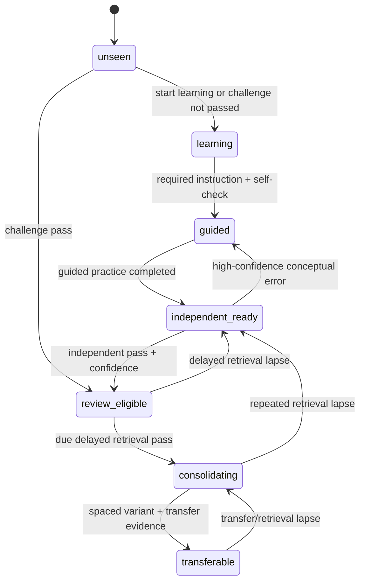

# M016 — State Transitions and Today Scheduler

## 🔄 状态机

该图描述允许的主转换；任何转换都必须由事件和 gate 触发，UI 不能直接写状态。

## 🚦 转换规则

| 当前态 | 触发与门槛 | 下一态 | 学习轴 | 能力轴 |
|---|---|---|---|---|
| unseen | 打开 Learning Mode | learning | partial | unassessed |
| unseen/learning | Challenge pass，无 hint、锁定、confidence | review_eligible | 不变 | independent_once |
| unseen/learning | Challenge fail/incomplete | learning | 不变 | unassessed 或保留既有证据 |
| learning | required instruction blocks 完成且 self-check 完成 | guided | complete | unassessed/guided_only |
| guided | required guided practice 完成 | independent_ready | 保留 | guided_only |
| independent_ready | 独立 rubric pass 且记录 confidence | review_eligible | 保留 | independent_once |
| independent_ready | 普通错误 | independent_ready | 保留 | 保留历史，追加失败证据 |
| independent_ready | 高信心概念性错误 | guided | 保留 | 保留历史，追加 misconception |
| review_eligible | 到期后 delayed retrieval pass | consolidating | 保留 | retained |
| review_eligible | delayed retrieval fail | independent_ready | 保留 | 不删除历史证据 |
| consolidating | 满足间隔的 variant/spaced retrieval 与一次陌生迁移通过 | transferable | 保留 | transferred |
| consolidating | 单次 lapse | consolidating 或 independent_ready，按错误类型 | 保留 | 保留历史证据 |
| transferable | 新情境暴露出 lapse | consolidating | 保留 | 保留历史，当前标签降为 retained |

完成规则必须配置但第一阶段固定为：

- instruction complete：所有 required `why_important`、`intuition`、`precise_definition`、`mechanism`、`worked_example`、`misconception` 块完成。
- guided complete：至少一个 required guided binding 提交；hint 可用，结果用于教学，不用于独立能力。
- independent pass：无 hint、先锁定、后反馈、confidence 必填，满足 unit rubric。
- delayed retrieval：必须在 `dueAt` 到达后完成；同一会话立即重答不算 delayed。
- transferable：至少一次间隔变式通过，加一次不同数据层级或真实项目情境的 far transfer 通过。

## 🧵 Active learning threads

`learning`、`guided`、`independent_ready` 计为 active thread。`unseen` 尚未开始；`review_eligible`、`consolidating`、`transferable` 是复习/应用态，不占 active thread。

- active thread 数量小于 2 时，Today 才可推荐一个新的 `unseen` 单元。
- 已有 2 个时，新的 unseen 单元不是合法候选，即使 project relevance 很高。
- 用户可以显式暂停一个 active thread；暂停保留状态但不进入 Today，重新开始时仍受 2-thread 上限约束。
- 新增第三个 thread 的 UI 动作必须要求先暂停一个，而不是静默替换。

## 🗓️ Today 三阶段算法

### 1. Learner state gate

对每个 active/verified Learning Unit：

1. 读取有效 unit revision 和 LearnerUnitState；缺失状态视为 `unseen`。
2. 验证 prerequisite start/independent gates。
3. 验证 active-thread 上限、暂停状态、dueAt 和内容 lifecycle/verification。
4. 拒绝 revision/hash 不匹配、缺失 binding 或不合法资产。

### 2. Legal activity type

严格按状态产生候选：

| State | Activity candidates |
|---|---|
| unseen | explanation, worked_example |
| learning | explanation, self_check |
| guided | guided_practice |
| independent_ready | independent_case |
| review_eligible | delayed_retrieval，且仅在 dueAt 后 |
| consolidating | variant_retrieval, spaced_retrieval，且仅在 dueAt 后 |
| transferable | paper_transfer, ai_audit_transfer, project_transfer, far_transfer |

用户主动打开内容可不受 Today 推荐限制，但能力事件仍必须满足对应 gate 才有效。Challenge 是单元入口动作，不是 Today 默认塞入的任务类型。

### 3. Priority ranking

只对合法候选排名。建议归一化信号和默认权重：

| Signal | Weight | 含义 |
|---|---:|---|
| due risk | 0.30 | 已到期、逾期时长、retrieval lapse |
| active-thread continuity | 0.25 | 优先完成已开始单元，降低切换成本 |
| misconception risk | 0.20 | 高信心错误、未解决危险误解 |
| prerequisite unlock value | 0.15 | 完成后可解锁通识骨架下一节点 |
| project relevance | 0.10 | 活跃项目疾病、设计、组学、方法匹配 |

稳定排序：priority 降序 → dueAt 升序 → curriculumOrder 升序 → unitId/bindingId 字典序。Project relevance 绝不参与 state gate。

## ⏱️ 队列装配

- 总预算使用 `settings.dailyMinutes`；单元学习任务按 8–12 分钟估计。
- 第一优先保护已到期的合法 retrieval；之后延续 active thread；有空位才开始新单元。
- 同一天可有多个活动，但不按模块凑数，不保证 Paper/AI/Problem/Transfer 各一项。
- 同一单元一次只给出“下一合法活动”，避免同时安排讲解、独立题和迁移题。
- 无合法候选时显示原因和可行动作，例如“两个学习线程进行中”“复习明天到期”，不回退到随机题。
- 完成/跳过只影响明确 task instance；不得用 `completedTaskIds` 推断 unit mastery。

## 🧪 必测不变量

1. unseen 永远不会收到 independent、review 或 transfer。
2. guided 永远不会收到无提示独立题。
3. Challenge pass 不写 `instructionCompletedAt`。
4. Project relevance 再高也不能越过 prerequisite 或 2-thread gate。
5. `review_eligible` 未到期时不生成 delayed retrieval。
6. pending/draft/archived 内容不进入 Today。
7. 固定拼盘代码路径不再驱动默认 Today。
8. 相同状态、时间和内容快照产生相同排序。
9. 内容 revision 变化不会改写旧 LearningEvent 的 revision/hash。
10. 迁移用户不会因旧浏览/教程/答题记录被自动标记 instruction complete 或 transferable。
