# ResearchOS 重构评估简报

_供 ChatGPT 进行独立产品、学习机制、信息架构与重构路线评估 · 基于 v0.12.0-rc1 · 2026-08-26_

---

## 📋 文档目的

这份文档不是新一轮开发指令，也不是为现有设计辩护。它希望让一位没有参与历史开发的评估者快速理解三件事：

1. ResearchOS 当前已经实现了什么；
2. 当前产品为什么在真实使用中让人感觉“还没学就被迫回答”；
3. 用户真正想要的产品是什么，以及下一次重构需要解决哪些根本问题。

请把当前版本视为一个工程基础较完整、科研安全约束较强，但学习主线存在方向性偏差的候选产品。评估重点应放在产品结构和学习体验，而不是继续增加零散功能。

### 一句话判断

ResearchOS 当前更接近一个“科研判断测评与复习系统”，而不是一个完整的“科研知识学习系统”。

当前主流程建立在一个隐含假设上：用户已经接触过相关知识，因此可以先独立作答，再通过锁定答案、反馈、错误观念和延迟复习强化判断。但软件的实际用户希望用它学习尚未掌握的新内容。于是首次使用就出现根本冲突：**系统把新手当成复习者，把首次学习当成基线考试。**

这不是文案问题，也不是增加一个教程就能解决的问题。它涉及首页、课程组织、内容模型、调度器、训练模式和新手引导的整体重构。

## 📍 当前软件现状

### 产品与技术状态

| 项目 | 当前状态 |
| --- | --- |
| 产品版本 | `v0.12.0-rc1` 候选版 |
| 运行平台 | Windows 本地桌面应用 |
| 技术栈 | React 19、TypeScript、Tauri 2、Rust、SQLite/WAL |
| 数据原则 | 本地优先、离线可用、显式导入导出 |
| 状态版本 | 前端 state schema 4；SQLite `user_version = 2` |
| 界面语言 | 中文优先，保留必要英文科研术语 |
| 当前候选质量 | 前端 89/89；Rust 27/27；M015 审计 31/31；后台构建与哈希通过 |
| 前台状态 | v0.12.0 打包应用尚未完成本轮前台人工验收 |

当前工程基础并不薄弱。系统已具备状态迁移、SQLite 持久化、恢复快照、确定性审计、异常安全、版本化内容、发布产物和较完整的自动化测试。重构不应推倒这些底层能力。

### 已实现的主要模块

| 模块 | 当前作用 | 当前主要问题 |
| --- | --- | --- |
| 今日学习 | 生成每日任务队列 | 混合新内容、复习、论文、方法、AI 审查和迁移，但没有以“是否已经学过”为首要分流条件 |
| 方法学训练 | 方法判断与锁定反馈 | 首次进入也偏向作答，没有完整的先修知识与系统讲解入口 |
| 科研常见问题库 | 搜索问题并进行八种诊断训练 | 强于诊断和审查，弱于从零建立概念模型 |
| 论文训练 | 重建证据链、图表任务与主张边界 | 假定用户已具有足够方法学框架 |
| AI 审查 | 判断 AI 方案是否合理 | 更适合作为综合练习，不适合作为新知识入口 |
| 复习系统 | 到期提取、高信心错误、陌生变式 | 机制本身有价值，但被过早应用到首次学习 |
| 技能地图 | 根据作答证据估计能力 | 主要依赖答题证据，无法表达“正在学习但尚未独立作答”的阶段 |
| 内容工作台 | 新增、复制、编辑、审核、版本比较、回滚 | 工程能力较强，但尚未围绕“课程/讲解/例题/练习”组织内容生产 |
| Obsidian 协作 | 显式发布与有限审核往返 | 边界设计合理，应保留克制模式，不应变成自动同步或日志倾倒 |

### 当前内容资产

现有内置资产包括证据来源、方法概念、研究模式、判断卡、AI 审查案例和 Problem Atlas 问题卡。已有内容强调：

- 科研设计与统计判断；
- evidence–claim boundary；
- 伪重复、数据泄漏、验证、单细胞推断等常见风险；
- 先作答、记录信心、锁定后反馈；
- 高信心错误形成错误观念并进入延迟变式复习；
- 将原则迁移到用户自己的科研项目。

这些内容大多被建模为“题目、判断、诊断、参考答案或 rubric”，而不是可连续学习的课程单元。另有 166 张外部遗留卡仍为 `unclassified`、待核验、不可导入；演示内容和未完成证据主张继续显示 `pending`。这些科学安全边界必须保留。

## 🔍 当前真实用户流程

### 首次进入

当前 onboarding 的核心措辞是：

- “你需要先独立作出研究决策，再查看精选参考答案”；
- 选择关注方向；
- 设置熟悉程度；
- 点击“开始基线盲测”。

即使用户把多个领域选择为“初学”，下一步仍然被引向锁定答案的陌生情境盲测。熟悉程度只调整难度，没有改变学习路径。


### 新手教程

当前约五分钟教程主要介绍：今日队列、问题库、待核验证据状态、先锁定再反馈、复习与迁移。教程中的唯一交互练习也是“选择故障层级并锁定，然后看反馈”。

因此它是“怎样使用训练系统”的操作教程，不是“怎样在 ResearchOS 中学习一个新概念”的学习教程。它解释了现有模式，却没有解决用户缺少知识输入的问题。

### 今日学习

当前 Today 通常安排以下任务：

1. 一条提取或到期复习；
2. 一项论文证据链任务；
3. 一项方法训练；
4. 一项 AI 审查；
5. 至多一个科研问题任务；
6. 一项项目迁移。

调度器会考虑薄弱程度、项目相关性、前沿价值、到期状态和错误观念，但没有可靠区分：

- 用户从未学习过；
- 用户看过讲解但还需要引导；
- 用户已经能独立提取；
- 用户只是暂时遗忘；
- 用户已经可以做复杂迁移。

结果是“低分”或“初学”主要影响题目难度与优先级，而不是决定应该先展示讲解、例题还是独立测验。

## ⚠️ 核心产品问题

### 学习输入缺位

当前系统拥有大量“输出要求”：作答、排序、诊断、判断、审查、迁移，却缺少与之对应的结构化“知识输入”：概念解释、先修知识、示范推理、完整例题和由浅入深的练习。

用户不是拒绝答题，而是拒绝在没有获得合理学习材料之前被迫答题。

### 新学与复习混为一体

“先锁定再反馈”适合已经学过的内容、诊断测验或挑战模式，不应该成为所有内容首次接触时的强制入口。系统目前缺少以内容为单位的学习阶段状态，也没有让 Today 根据阶段选择不同活动类型。

### 内容模型偏向题库

现有内容对象擅长表达：问题、候选原因、检查、证据、参考答案、rubric、来源和状态。但它们不足以表达一门可学习的微课程，例如：

- 学习目标；
- 必要先修概念；
- 中文核心讲解；
- 术语桥接；
- worked example；
- 常见误解及反例；
- 引导练习；
- 独立练习；
- 迁移任务；
- 何时可以进入复习。

### 功能多于主线

导航已经包含 Today、文献库、论文训练、方法学训练、问题库、内容工作台、复习、AI 审查、前沿、项目、技能地图、评估和设置。每个模块都有合理用途，但首次用户缺少一个清晰答案：

> “我今天究竟要学什么？从哪里开始？学完以后做什么？”

当前产品更像多个科研训练工具的集合，而不是一条能够每天持续使用的学习路径。

## 🎓 用户真正想要的产品

### 核心定位

用户希望 ResearchOS 成为一个供自己长期使用的中文科研学习系统：

- 能从不熟悉的知识开始学习，而不是先考试；
- 学完之后通过练习、提取、错误修复和迁移真正掌握；
- 能持续加入自己的新内容；
- 能把旧内容导出审核、修订、比较版本和回滚；
- 能与 Obsidian 协作，但不会把日志、题目、AI 输出和临时内容随时倾倒进 Vault；
- 能明确显示来源、待核验状态和科学结论边界；
- 核心功能本地可用，不依赖聊天式界面。

### 目标学习流程

默认路径应从“学习模式”开始；盲测变成可选的摸底或挑战路径。

```mermaid
flowchart LR
    accTitle: 目标学习闭环
    accDescr: 目标流程先建立知识理解，再逐步撤除提示进入独立作答、延迟复习和真实项目迁移。

    choose_goal([🎯 选择学习目标]) --> check_stage{🔍 是否学过}
    check_stage -->|未学过| learn_concept[📚 学习核心概念]
    check_stage -->|已学过| optional_test[🧪 可选摸底测试]
    learn_concept --> worked_example[📋 阅读完整例题]
    worked_example --> guided_practice[✏️ 完成引导练习]
    guided_practice --> independent_answer[🔒 独立锁定作答]
    optional_test --> independent_answer
    independent_answer --> delayed_review[🔄 延迟提取复习]
    delayed_review --> project_transfer([🎯 真实项目迁移])

    classDef start fill:#ede9fe,stroke:#7c3aed,stroke-width:2px,color:#3b0764
    classDef learn fill:#dbeafe,stroke:#2563eb,stroke-width:2px,color:#1e3a5f
    classDef decision fill:#fef9c3,stroke:#ca8a04,stroke-width:2px,color:#713f12
    classDef success fill:#dcfce7,stroke:#16a34a,stroke-width:2px,color:#14532d

    class choose_goal start
    class check_stage decision
    class learn_concept,worked_example,guided_practice,optional_test,independent_answer learn
    class delayed_review,project_transfer success
```



### 两种明确模式

| 模式 | 默认性 | 适用对象 | 首屏行为 |
| --- | --- | --- | --- |
| 学习模式 | 默认 | 新知识、自学、系统补课 | 显示学习目标、讲解、例题和引导练习 |
| 挑战模式 | 可选 | 已有基础、摸底、自测 | 不预先展示答案，直接锁定作答 |

用户选择“初学”时，系统必须默认进入学习模式。基线盲测可以保留，但必须可跳过，并清楚解释用途和代价。

### Today 的目标结构

Today 不应再是固定模块拼盘，而应成为学习阶段驱动的队列。建议至少区分三类卡片：

| 卡片类型 | 触发条件 | 用户动作 |
| --- | --- | --- |
| 新知识 | 从未完成学习单元 | 学讲解、看例题、做低风险检查 |
| 到期复习 | 已经完成独立练习且到期 | 无提示提取、信心标注、锁定反馈 |
| 迁移应用 | 已具备基础掌握证据 | 应用于新领域、论文或自己的项目 |

到期复习仍应受到保护，但不能把所有“尚未掌握”都解释为需要更多盲答。新知识每天数量应有界，用户可以暂停或改换主题。

### 目标学习单元

每个可学习主题至少需要以下组成：

1. 主题与学习目标；
2. 前置知识和预计时间；
3. 中文核心讲解及标准英文术语；
4. 适用场景与不适用场景；
5. 一份完整 worked example；
6. 常见误区、反例和 evidence–claim boundary；
7. 带提示的引导练习；
8. 无提示的独立练习；
9. 延迟复习与远迁移变式；
10. 来源、证据范围与核验状态。

“先学”不能退化成连续浏览长文章。学习单元仍应要求预测、解释、自我检查和逐步撤除提示，只是不能在零输入条件下强制作答。

## 🏗️ 重构时应保留与改变的部分

### 应保留的基础

- 本地优先的 Tauri、React、Rust、SQLite 架构；
- 数据迁移、备份恢复、原子写入和崩溃安全；
- 稳定 ID、revision、hash、历史和 rollback；
- 科学内容 `pending`、`verified` 等状态边界；
- DOI/PMID 元数据与 claim verification 的严格分离；
- 错误观念、信心校准、延迟复习和远迁移机制；
- Problem Atlas 的诊断模式，但将其放到合适的学习阶段；
- 内容工作台、审核包和旧内容 overlay 修订；
- Obsidian 的显式有限批次、预览确认、受管块和零自动同步原则；
- 中文优先、键盘可用、高 DPI 和不打扰用户电脑的测试政策。

### 必须重新设计的部分

- onboarding 的“默认基线盲测”；
- Today 的固定模块式任务编排；
- “初学”只改变难度而不改变活动类型的逻辑；
- 方法、问题、论文和 AI 审查之间缺少先修关系的问题；
- 缺少课程、章节、学习单元和掌握阶段的内容模型；
- 首次学习和到期复习共用同一种锁定答题体验；
- 技能地图只看作答证据、无法表达学习进度的问题；
- 导航模块过多但缺少默认主线的问题；
- 教程介绍功能而不实际教会一个概念的问题。

### 建议新增的核心状态

评估者可以提出更好的命名，但至少需要表达以下生命周期：

```text
unseen
→ learning
→ guided_practice
→ independent_practice
→ review_eligible
→ consolidating
→ transferable
```

状态不能只靠用户点击“完成”推进。至少应结合必要材料完成情况、引导练习表现、独立作答证据、延迟提取和迁移表现。与此同时，不应制造虚假的精确“掌握率”。

## 🔗 内容维护与 Obsidian 目标

### ResearchOS 仍是 canonical store

用户希望以后能方便地增加内容，也能取出旧内容进行审核和修订。因此 M015 的内容工作台不是需要删除的旁支，而应扩展到新的学习单元模型：

- 新建课程、主题和学习单元草稿；
- 复制内置内容形成个人 overlay；
- 导出主题及依赖、来源和练习 rubric；
- 由 ChatGPT、Codex、OpenScience 或人工审阅；
- 以 versioned patch 导入；
- 所有科学内容默认保持待核验；
- 旧版本可比较、可追溯、可回滚；
- 应用升级与个人修订冲突时要求人工处理。

### Obsidian 只承担策划式输出

Obsidian 不应成为第二数据库，也不应持续接收 ResearchOS 的行为日志。建议继续坚持：

- 连接 Vault 只做只读验证；
- 只在用户选择具体内容、查看精确 diff 并确认后发布；
- 默认发布“成熟的概念笔记”，而不是每道题、每条来源、每次作答或每段 AI 输出；
- 用户在受管块之外的笔记逐字节保留；
- 没有 watcher、自动同步、自动合并或自动清理；
- 从 Obsidian 回读的修改只能成为 `draft` 或 `pending_review` 候选。

重构需要评估的不是“要不要更多 Obsidian 功能”，而是新的课程/学习单元应在什么成熟阶段才值得被策划式发布为一篇长期笔记。

## 🛡️ 不可牺牲的边界

无论怎样重构，以下约束不能因为追求流畅体验而删除：

1. AI 生成或实质改写的科研内容默认 `pending`；
2. DOI/PMID 能解析不等于相关主张被证实；
3. 因果、统计、生存、预测、单细胞、空间、多组学和 evidence–claim boundary 仍需高风险审核；
4. 本地私人启用与科学核验是两个独立动作；
5. 应用升级不得静默覆盖个人修订；
6. Obsidian 不得自动倾倒、扫描整个 Vault 或覆盖用户手写内容；
7. 不得为了提高内容数量而自动把 166 张隔离卡分类、导入或标记为可靠；
8. ResearchOS 是学习与科研判断工具，不是临床决策系统或自动科研代理；
9. 自动化测试不得抢占用户鼠标、键盘、焦点、窗口或修改显示设置；
10. 重构必须提供旧状态迁移路径，不得要求用户重置数据。

## 🤔 希望 ChatGPT 重点评估的问题

请评估者不要直接输出一份泛泛的功能清单，而要对以下问题作出明确判断：

1. 上述产品诊断是否准确？还有哪些更根本的定位冲突？
2. ResearchOS 应定位为课程型学习系统、案例型训练系统，还是两者组合？主入口应该是什么？
3. “先学习”和“先作答”应如何按用户阶段、主题熟悉度与任务目的分流？
4. 最小可行的学习单元 schema 应包含哪些字段和子对象？
5. 课程、主题、方法、问题卡、判断卡、证据来源和个人项目之间应该是什么关系？
6. Today 应如何调度新知识、引导练习、到期复习和迁移，避免固定模块拼盘？
7. onboarding 如何在五分钟内让用户真正学会一个概念，而不是只介绍功能？
8. 哪些现有页面应该保留为一级导航，哪些应合并、降级或隐藏？
9. 如何迁移现有题库型内容，使其复用为例题、练习或迁移任务，而不是全部重写？
10. 内容工作台应如何支持课程内容新增、旧内容审核、版本冲突和科学状态管理？
11. Obsidian 内容何时才算“成熟到值得发布”，这个条件应由什么状态或人工动作控制？
12. 重构的 MVP 应覆盖什么，哪些复杂功能应暂时冻结？
13. 如何设计可验证的学习效果指标，同时避免虚假的掌握率和游戏化噪声？
14. 重构过程中最大的状态迁移、内容迁移、科学风险和用户体验风险是什么？

### 希望评估输出采用的结构

请按以下顺序给出结论：

1. 对当前产品的直率诊断；
2. 推荐的产品定位与核心用户旅程；
3. 推荐的信息架构和一级导航；
4. 推荐的学习状态机与 Today 调度原则；
5. 推荐的最小内容模型；
6. 现有模块的“保留 / 改造 / 合并 / 暂停 / 删除”矩阵；
7. 分阶段重构路线与每阶段验收标准；
8. 数据迁移与向后兼容方案；
9. 科学审核、AI 和 Obsidian 边界；
10. 最值得先做的三个原型或用户测试；
11. 仍需用户回答的关键问题。

请明确指出不同方案的代价，不要默认“保留所有功能”，也不要因为现有工程投入较多就回避删除或降级错误的产品入口。

## 📚 本文依据

本文根据以下项目内事实整理，未引用外部学习科学结论：

- `.agent/PRODUCT_CONSTITUTION.md`
- `.agent/SCIENTIFIC_GATES.md`
- `.agent/PROJECT_STATE.md`
- `.agent/CURRENT_MILESTONE.md`
- `.agent/M015_PERSONAL_CONTENT_STUDIO_PLAN.md`
- `src/components/Onboarding.tsx`
- `src/components/Tutorial.tsx`
- `src/features/today/TodayView.tsx`
- `src/learning/scheduler.ts`
- `src/app/navigation.ts`
- `release/RELEASE_NOTES_v0.12.0.md`

现阶段只请求评估，不授权评估者直接改代码、运行应用、访问真实 Obsidian Vault、提升科研内容状态或删除现有数据。

---

_文档状态：待外部评估 · 当前候选基线：`v0.12.0-rc1`_
