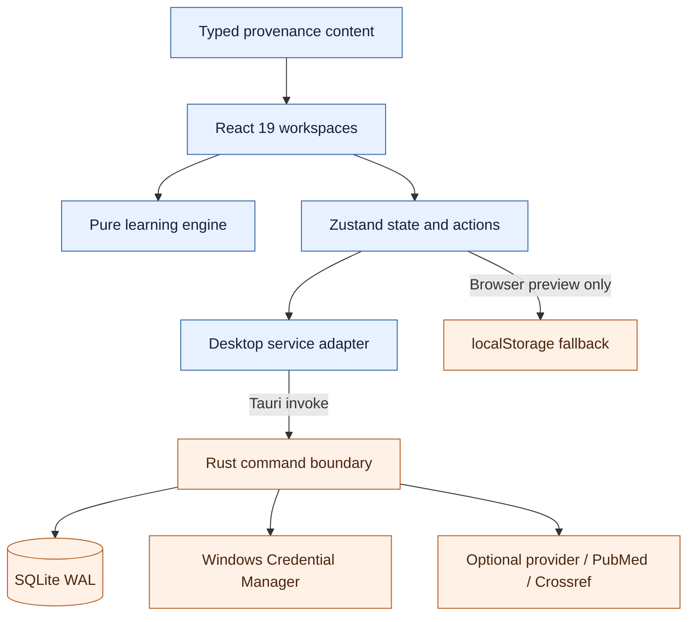

# ResearchOS architecture

*Runtime, trust-boundary, persistence, and release architecture for v0.10.*

---

## 🧩 Runtime shape

Tauri creates one WebView window during Rust setup so its data directory can live beneath the selected ResearchOS data directory. That design supports isolated smoke runs and prevents WebView storage from escaping the chosen data root.

## 🖥️ Frontend boundaries

`src/app` owns routing, lazy view boundaries, restoration, and global keyboard behavior. `src/features` contains workspaces; Paper Lab and PDF.js are lazy-loaded. `src/components/AttemptFlow.tsx` enforces the human-first contract. `src/learning` contains pure scheduler/review/scoring functions. `src/data` contains typed, source-linked seed content. `src/state/store.ts` is the only place that coordinates state mutations and persistence.

Calibration is centralized in `recordCalibration`: it writes correctness once, adds one skill-evidence record, creates/updates one review, and opens an explicit misconception only for wrong high-confidence responses. Feature views cannot independently duplicate those side effects.

## 💾 State and database

The serializable frontend schema is v2 and migrates v1 without dropping user arrays/settings. A future unknown schema is rejected rather than downgraded or overwritten. Drafts, misconceptions, onboarding, assessment runs, recovery state, and persistence diagnostics are first-class state.

Rust applies database migrations transactionally and verifies `PRAGMA user_version=2`. Canonical state is atomically stored in `app_state`; normalized/entity tables remain available for forward evolution. SQLite uses WAL, a five-second busy timeout, and five bounded pre-save snapshots. Backup import opens the candidate read-only, runs `PRAGMA integrity_check`, verifies ResearchOS state, and only then writes restored state.

## 🔌 Native commands

- State/data: `load_state`, `save_state`, `database_health`, `upsert_entity`, `list_entities`
- Secrets: `secure_set_api_key`, `secure_get_api_key`, `secure_delete_api_key`
- Optional network: `test_ai_provider`, `ai_review`, `verify_evidence`
- Recovery: `export_backup`, `import_backup`

The UI adapter returns structured failures; save errors are exposed in System Health instead of being swallowed.

## 🛡️ Security and scientific trust

- Provider credentials never enter Zustand, SQLite state, backups, exports, prompts, or logs.
- The learner's answer is locked before optional AI review; model output cannot alter the original response or seed content.
- AI requests delimit untrusted learner text, use task-specific instructions, require exact JSON, and reject malformed payloads.
- `contentOrigin=ai_generated` cannot coexist with `verificationStatus=verified`.
- Identifier resolution and claim verification are separate scopes.
- Network calls are optional; local learning, projects, PDF use, review, and exports remain functional without a provider.
- Local PDFs remain user-selected. No licensed full text is distributed.

## ⚡ Performance boundaries

Initial JavaScript is 1,852,793 bytes; Paper Lab (862,770 bytes), its worker (1,232,303 bytes), and expanded training content (81,995 bytes) are separate payloads. Global search demand-loads content indexes. Today uses narrowed Zustand selectors, and deterministic scheduling averages 0.1307 ms.

## 📦 Build and release

TypeScript emits `.build`, Rollup emits `dist`, Cargo builds `src-tauri/target`, and Tauri packages an NSIS current-user installer. Content/performance reports are generated release gates. Version is aligned across npm, Cargo, Tauri, build metadata, artifact names, and schema documentation.

The local Cargo transport proxy/configuration used in the restricted build environment is development-only and is not packaged or retained as release configuration.
