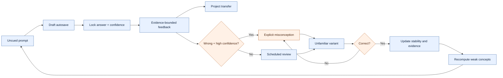

# ResearchOS learning-engine validation

*Mechanism and implementation validation for v0.10; alignment with learning principles is not proof of educational or clinical effectiveness.*

---

## 🧭 Mechanism map

## ✅ Requested learning principles

| Principle | Implemented mechanism | Validation evidence | Boundary |
|---|---|---|---|
| Retrieval practice | Answer required before reference feedback | response-lock tests | No direct comparison with rereading |
| Spacing | Due dates, stability, difficulty, lapses, delayed reviews | scheduler/review tests | Not a full FSRS parameter optimizer |
| Interleaving | Five-task Today queue mixes foundation, weakness, project relevance, due work, and occasional frontier content | deterministic queue tests | Optimal mixture is not empirically tuned |
| Feedback | Correct points, omissions, severity, rationale, maximal conclusion, and sources after lock | feedback-gating tests | Feedback quality depends on reviewed seed content |
| Transfer | Project-specific prompt and persisted transfer note | export/store integration tests | Real-world behavior change not measured |
| Confidence calibration | Confidence recorded before correctness; skill evidence penalizes confidently wrong responses | calibration/idempotency tests | Calibration metrics need longitudinal data |
| Misconception correction | Explicit open misconception; next-day priority; unfamiliar variant; correct-only resolution | state-machine tests | Semantic equivalence of hand-authored variants is not psychometrically calibrated |
| Blind assessment | Three unfamiliar cases, locked original answer, domain rubric, baseline/longitudinal scores | assessment tests | No external rater reliability or validated scale |

## 🧮 Scoring and evidence policy

Skill evidence is withheld until at least three observations span two concepts. The estimate combines correctness, confidence calibration, delayed retrieval, difficulty, transfer, and unresolved misconceptions. The interface reports an evidence band, reliability, observation count, and last-tested date instead of presenting a spurious precise trait score.

Assessment and practice are intentionally separated: submitting a blind assessment does not create mastery evidence. Rubric domains—problem framing, design, bias, analysis, interpretation, and transfer—are scored 0/1/2 only after the original response is locked.

## 🗓️ Scheduler validation

Today ranks candidates using editable weights for weakness, project relevance, review-due status, frontier value, and misconception risk, then enforces variety and a bounded five-item queue. It prioritizes dangerous misconceptions without displaying punitive backlog counts. The deterministic benchmark averaged 0.1307 ms per schedule over 2,000 runs.

The review-state shape is FSRS-compatible (due date, stability, difficulty, lapse count, last review), but v0.10 does not claim equivalence with an official FSRS optimizer.

## 🧪 Automated validation

The 19 frontend/integration checks include answer locking, feedback gating, draft persistence, centralized idempotent calibration, due scheduling, high-confidence error capture, variant-only resolution, project-aware ranking, evidence withholding, exports, migration, AI schema parsing, and server rendering. Seven Rust tests cover storage, migration, snapshots, backup/restore, entity behavior, URL validation, and provenance invariants.

## ⚠️ What remains unvalidated?

- Learning gain, retention, transfer, and calibration have not been tested in a randomized or longitudinal user study.
- The assessment rubric lacks psychometric validation, inter-rater reliability, measurement invariance, and a minimally important difference.
- Scheduler weights and interval updates are principled heuristics, not parameters fitted to ResearchOS outcome data.
- Content difficulty labels and unfamiliar variants are expert-authored categories, not item-response-theory calibrations.
- No evidence establishes that time spent in the product improves publication quality, clinical decisions, or patient outcomes.

> 软件机制符合检索练习、间隔、交错、反馈、迁移与校准等已知学习原则，不代表已经完成临床或教育学效果验证。

## 🧾 Validation conclusion

ResearchOS v0.10 implements the requested deliberate-practice loop coherently and has automated evidence that its state transitions and safety invariants behave as designed. It must be described as a learning-mechanism implementation—not as a proven intervention for improving scientific ability.
